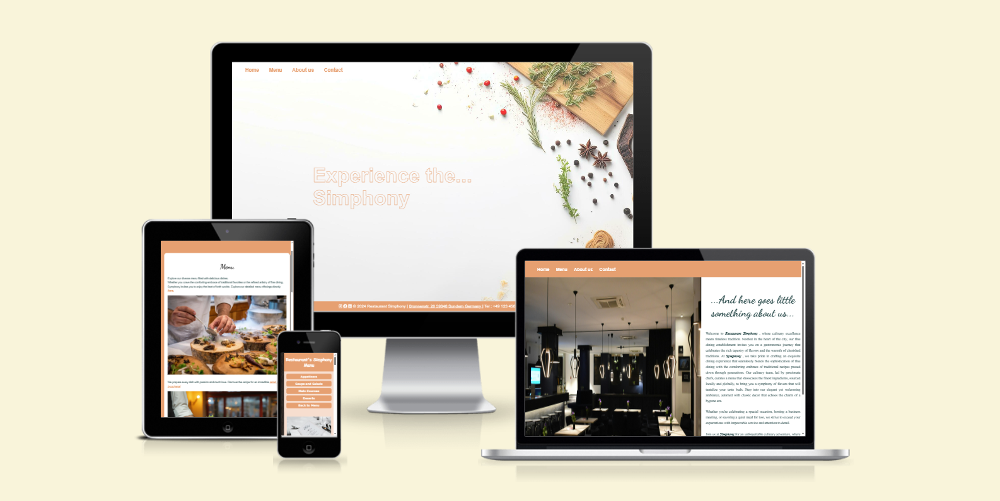
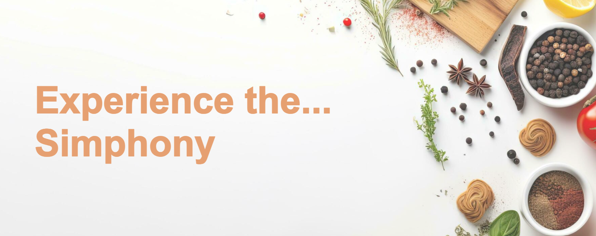
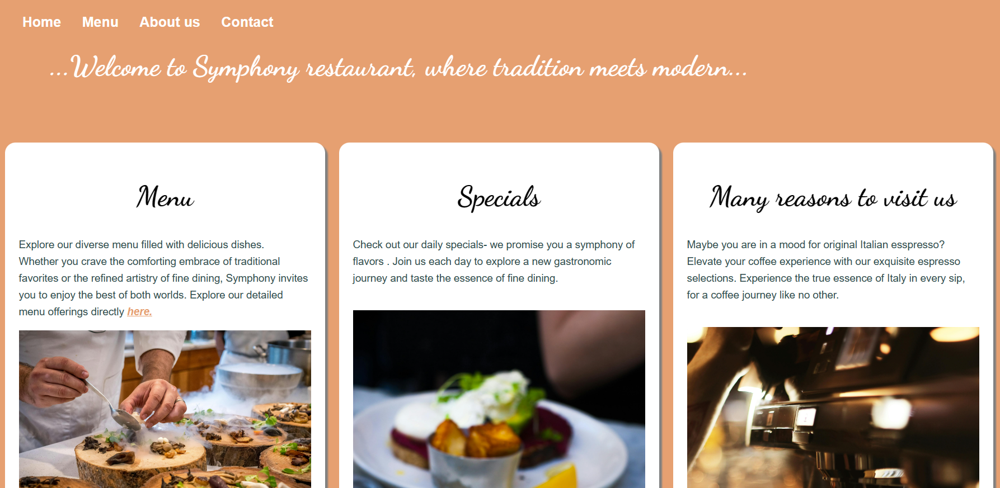
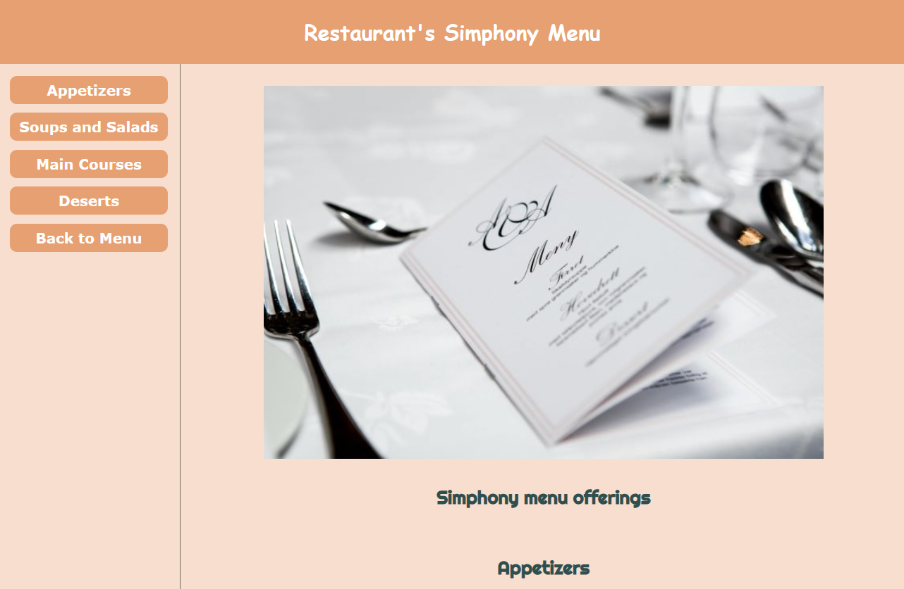
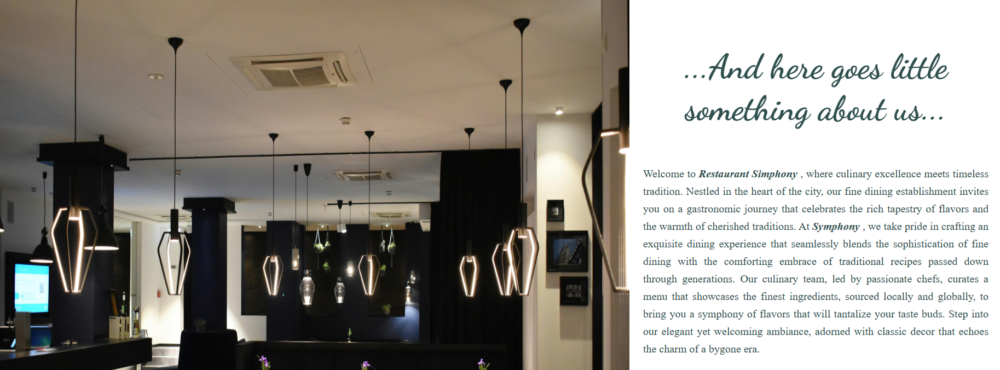
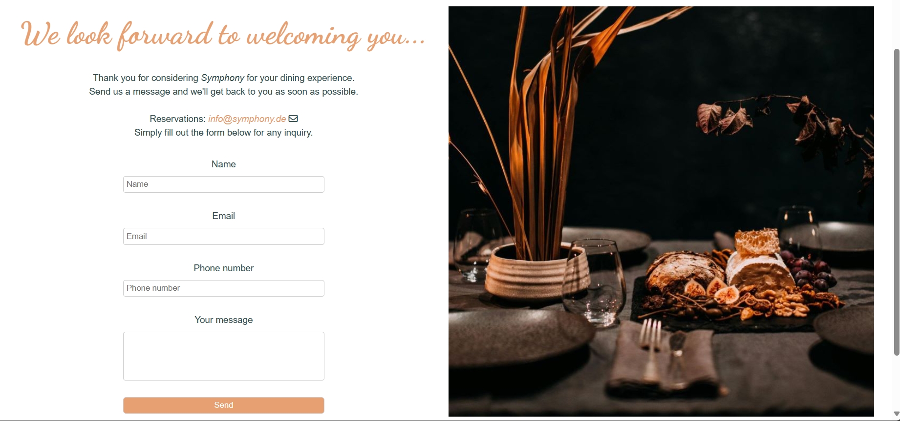
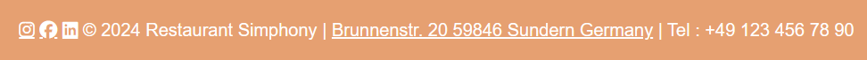
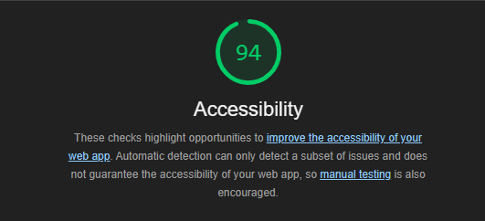

# Restaurant Simphony Website

Welcome!

This document will provide an overview of the website's structure, content and technologies used.
The Restaurant Simphony website is designed to showcase the features and offerings of the restaurant.

Through a combination of informative content, engaging visuals, and user-friendly navigation, the website aims to attract potential customers and provide them with essential information about Restaurant Symphony.

# Features

## Existing Features

### Navigation bar

* Featured on all four pages, the full responsive navigation bar includes links to the Home page, Menu pages , About us page and the Contact page and is identical in each page to allow for easy navigation.

* This section will allow the user to easily navigate from page to page across all devices .

* ### The Home Page

    + The main page is featured with a minimalist "less is more" design, with a simple background image that puts food in the spotlight, while an animated text element catches users' attention and invites them to explore further. 

* ### The Menu page

     + The menu page provides users with a comprehensive overview of what a restaurant has to offer, with a main page featuring tempting images and insights into the menu choices, including a recipe.

  * ### Menu Sub-page

     + The detailed sub-page includes the full menu for users to explore.

     + Each segment is accompanied by descriptive text and illustrative images to highlight its meaning and benefits.

* ### About us

   + In About us section users can learn more about the restaurant's mission and vision. Users can get an idea of what sets the restaurant apart and why they should dine with Simphony.

* ### Contact

   + The Contact page offers a simple contact form that users can use to get in touch with us if they have any feedback, bookings or other questions. 

* ### Footer

   + The footer bar includes links to social media profiles, allowing users to stay updated on the latest news and promotions. Additionally, it features restaurant's address with a direct link to the location on maps for easy navigation, as well as the phone number for quick inquiries and reservations. 

   + This comprehensive footer ensures that users can easily access essential information and connect with our restaurant across various channels.

### Features left to Implement

* It includes FAQs and links to customer support resources to help users resolve any issues they may encounter while using Restaurant Symphony website.

### Technology used

 * HTML , CSS
 * GitHub, Gitpod

## Testing

1. #### Functionality

* Verified that all interactive elements (buttons, links, forms) are functional.
* Tested any user inputs and ensured they produce the expected outcomes.
* Checked for any error messages or unexpected behavior.

2. #### Layout and Design Testing

* Reviewed the layout and design of the website.
* Ensured that the content is well-structured and aligned.
* Tested the responsiveness of the website by resizing the browser window or using developer tools to simulate different device sizes.
* Confirmed that the website looks visually appealing on various screen sizes.

3. #### Reporting issues
* Please note that the website's appearance varies significantly in dark mode, with animated text disappearing; therefore, it's recommended to view and interact with the website in light mode for optimal user experience.

## Validator Testing

* HTML
   + No errors were returned when passing through the official [W3C validator](https://validator.w3.org/)
* CSS
   + No errors were found when passing through the official (Jigsaw) validator [(Jigsaw) validator ](https://jigsaw.w3.org/css-validator/)

* Accesibility
  + I confirmed that the colors and fonts are chosen are easy to read and accessible by running it through lighthouse in devtools.

  

## Bugs

  * When I deployed my project to GitHub , I discovered that the Favicon was not displaying on the Contact Page.
  The reason behind this issue was that the path to favicon was not added correctly.
  Fixed this by adding the correct path.

## Unfixed bugs
 * Dark mode visibility - The landing page isn't showing the Animated Text due to dark mode.

## Deployment

* The site was deployed to GitHub pages. Since I started building my website on VSCode a desktop version and got bigger part of it, I first uploaded the already coded files to IDE and after added few changes, deployed it to GitHub. The steps to deploy are as follows:
   + In the GitHub repository, navigated to the Settings tab
   + From the source section drop-down menu, selected the Master Branch
   + Once the master branch has been selected, the page was automatically refreshed with a detailed ribbon display to indicate the successful deployment.
   + It took some 5 minutes for the project to be deployed.

The live link can be found here - https://lin2907.github.io/Symphony/

## Credits

* ### Content
   + The animated text for The Home page was taken from the tutorial [Create Text Animation For Website Using CSS](https://www.youtube.com/watch?v=mikht2lEnI0)

   + Letter fade effect used on Menu, About and Contact page was taken from WEBD 5 book from ILS Hamburg school

   + The icons in the footer and for the Contact page were taken from [Font Awesome](https://fontawesome.com/)

   + The Favicon was taken from [Favicon.io](https://favicon.io/)

* ### Media
   + The photos used on all pages were taken from [Pexels](https://www.pexels.com/)

 
  Thank you for reading ! I hope you find the Simphony website helpful and enjoyable to use.

